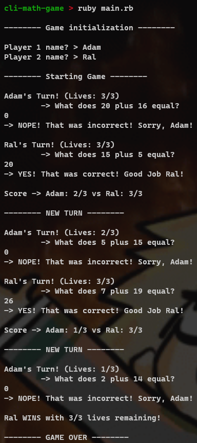

# Result



# **Planning phase**

## **Goal**

Create a 2-Player math game where:

- Players take turns to answer simple math addition problems.
- A new math question is generated for each turn by picking two numbers between 1 and 20.
- The player whose turn it is is prompted the question and must answer correctly or lose a life.
- Both players start with 3 lives. They lose a life if they mis-answer a question.
- At the end of every turn, the game should output the new scores for both players, so players know where they stand.

## Extracting Nouns for Classes

- Player
- Question
- Game

## Writing class roles

### **Player**

- State: `name`, `lives`
- Behaviour: `wrong`, `lost?`, `ask`

### **Question**

- State: `number1`, `number2`, `answer`
- Behaviour: `to_s`, `check?`

### **Game**

- State: `player1`, `player2`
- Behaviour: `start`, `new_turn`, `check_lives`, `current_score`, `winner`

```
What information is relevant to each class?
-> Player: keeping track of players' lives/names
-> Question: generate a new question to ask
-> Game: initialize and start the game, then loop till game over
```

```
What will they need in order to be initialized?
-> Player: player name
-> Question: n/a
-> Game: user input for names
```

```
What public methods will be defined on them?
-> Player:
  ask (to ask the player a new question),
  lost? (checks if player has lost),
-> Question:
  to_s (to output the question in string format) - override
  check? (to check whether user's answer is correct)
-> Game: start (to start the game)
```

```
Which class will contain the game loop (where each instance of the loop is the other players turn)?
-> Game class

Which class(es) will contain user I/O and which will not have any?
-> Question: No Input, outputs the question
-> Player: Has user input for player's answer to the question, has output for whether or not the answer is correct
-> Game: Has user input for player name, has output for game phases and scores + ending winner
```

> Another approach would be to keep track of current user and alternate between players every round iteration, where every iteration is a new question rather than asking 2 questions (1 question each) on every iteration (round). This way we would instantiate the question in Game class instead of Player class.
